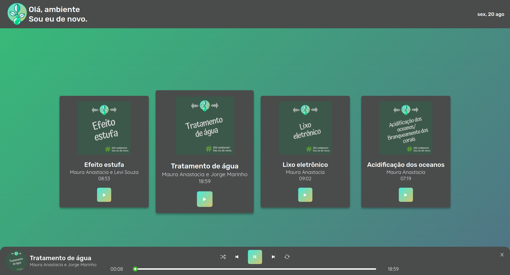
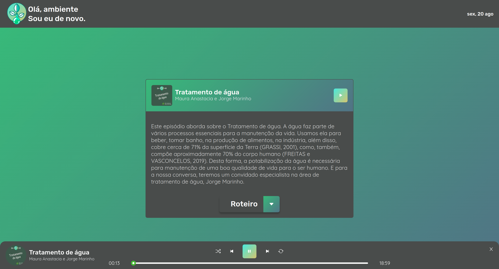
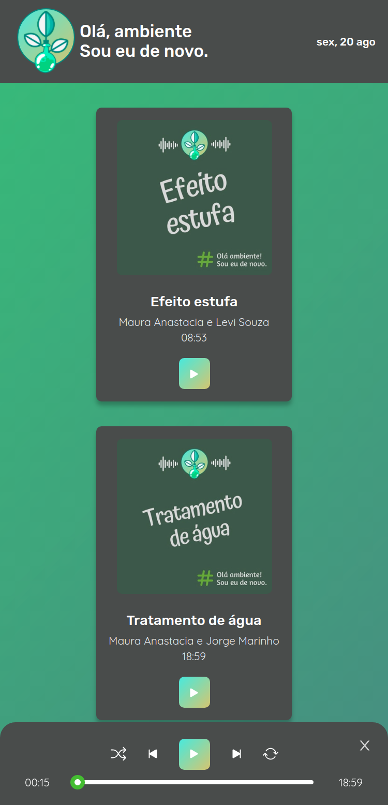
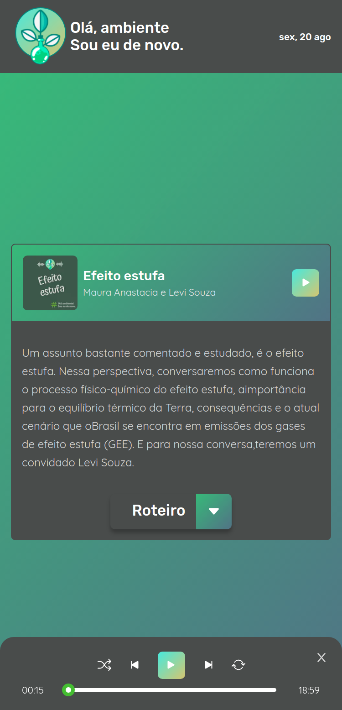

<p align="center">
  

  
  
  <a href="https://github.com/IgorTargino/podcast-ola-ambiente/commits/master">
    
  </a>
    
   
  
</p>

## 🧐 Sobre o projeto

Uma aplicação para ouvir podcasts :headphones: <br>
<a align="center" target="blank" href="https://podcast-ola-ambiente.vercel.app/">

</a>

## 🎨 Layout

|         Tela 1 - desktop          |         Tela 2 - desktop          |
| :-------------------------------: | :-------------------------------: |
|  |  |

|         Tela 1 - mobile          |         Tela 2 - mobile          |
| :------------------------------: | :------------------------------: |
|  |  |

## ⚙️ Funcionalidades

- [x] Player:
  - [x] Botão togglePlay - para tocar/pausar o episódio;
  - [x] Botão shuffle - para tocar em ordem aleatória;
  - [x] Botão loop - para tocar o podcast atual em loop;
  - [x] Botão next - para tocar o próximo podcast;
  - [x] Botão previous - para tocar o podcast anterior;
  - [x] Botão close - para fehcar o player
  - [x] Slider - para controle de minutagem do podcast;
- [x] Página Home:
  - [x] Listagem dos episódios lançados;
  - [x] Botão play para tocar o episódio selecionado;
- [x] Página do Episódio:
  - [x] Descrição e informações do episódio;
  - [x] Botão de play para tocar o episódio;
  - [x] Botão de roteiro - para download do roteiro do episódio em pdf;
- [x] Responsividade;
- [x] Animação;

## Como executar o projeto

### Pré-requisitos

- git
- Node.js
- NPM ou Yarn

### Variáveis de Ambiente

Além das ferramentas anteriores é necessária criar uma váriavel de ambiente .env.local na raiz do projeto e adicionar a seguinte variável

API_URL=https://my-json-server.typicode.com/IgorTargino/podcast-ola-ambiente

### Instalação

```
# Abra o terminal e copie este repositório com o comando
$ git clone https://github.com/IgorTargino/podcast-ola-ambiente.git

# Acesse a pasta do projeto no prompt de comando
$ cd podcast-ola-ambiente

# Instale as dependências
yarn install
ou
$ npm install

# Execute a aplicação
$ yarn dev
ou
$ npm run dev

# Acesse http://localhost:3000 no seu navagador.

```

## 🚀 Tecnologias

Tecnologias utilizadas para desenvolver o projeto:

- next.js
  - SSR e SSG
- react.js
- typescript
- context
- axios
- sass

## 🦸‍♂️ **Autor**

<p>
 <sub><strong>🌟 Igor Targino Marinho🌟</strong></sub>
</p>

[](https://www.linkedin.com/in/igor-targino/)
[](mailto:igortargino01@gmail.com)

> Se te ajudou, dá ⭐, vai me ajudar também 😉
